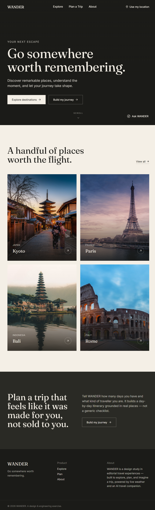
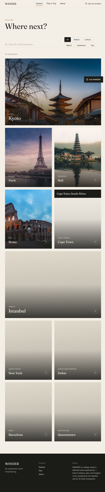
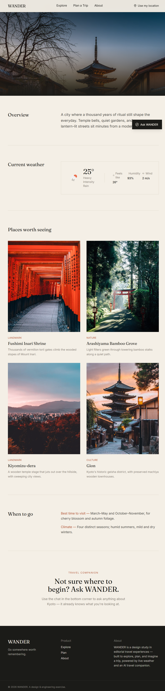
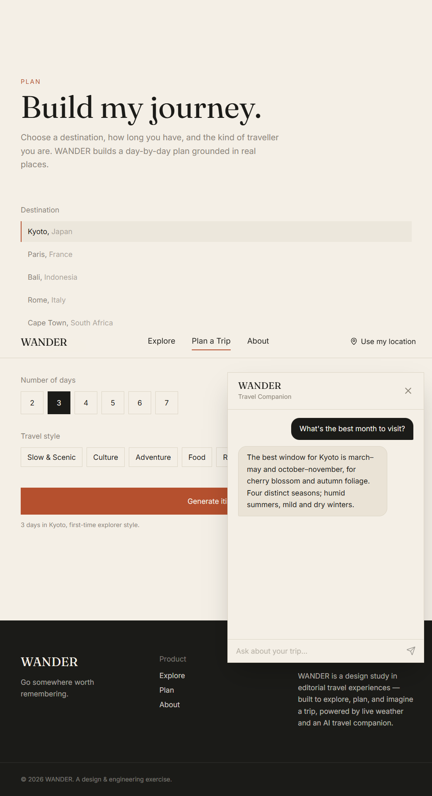
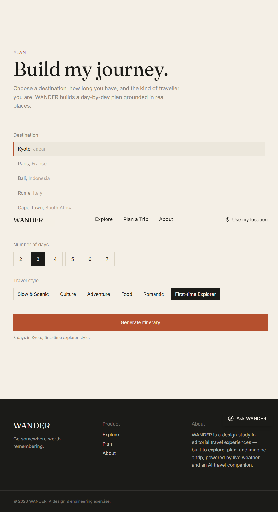

# WANDER

**Go somewhere worth remembering.**

WANDER is a premium, editorial travel web app: explore destinations, read a designed detail
page per place, check live weather, talk to an AI travel companion, and generate a structured,
day-by-day itinerary — all in a restrained, magazine-style visual language.

**Live app:** https://wayfarra-travel-app.vercel.app

---

## 1. Project overview

WANDER is a single-page React application built with Vite. It is not a mockup: routing, search,
filtering, geolocation, live weather, dynamic photography, an AI chat assistant, and AI-generated
itineraries are all wired up and functional. Every integration that needs a paid API key degrades
gracefully to a well-designed fallback state (or a local demo generator) when the key isn't
present, so the app is fully usable — including the "AI" features — with zero configuration.

## 2. Features completed

- **Home** — cinematic hero (video background with an animated image fallback), featured
  destinations, and a call to action into the itinerary planner.
- **Explore** — search, category filters, and an asymmetric editorial grid of 10 destinations.
- **Destination detail** — hero, overview, live weather, a "places worth seeing" gallery, best
  time to visit, and an entry point into the AI companion.
- **Itinerary Planner** — pick a destination, trip length, and travel style; get back a
  structured, timed, day-by-day itinerary rendered as a vertical timeline (not a wall of text).
- **Travel Companion** — a floating AI chat (desktop panel / mobile bottom sheet) that is aware
  of whichever destination you're currently viewing.
- **Location awareness** — "Use my location" via the browser Geolocation API, with a manual
  search fallback if permission is denied or unsupported.
- Loading, empty, and error states designed specifically for each feature (weather, images, AI
  chat, itinerary generation, search).

## 3. Screenshots

| Home | Explore |
|------|---------|
|  |  |

| Destination + Weather | Travel Companion |
|------------------------|-------------------|
|  |  |

| Itinerary Planner |
|------------------|
|  |

## 4. Tech stack

| Layer          | Choice                                   |
|----------------|-------------------------------------------|
| Framework      | React 19 + Vite                           |
| Routing        | React Router v7                           |
| Styling        | Tailwind CSS (custom design tokens)       |
| Motion         | Framer Motion                             |
| Icons          | lucide-react                              |
| Weather        | OpenWeather API                           |
| Photography    | Unsplash API (or Pexels), with hotlinked fallbacks |
| AI             | Google Gemini (`gemini-2.0-flash`)        |
| Geocoding      | Open-Meteo geocoding (free, no key)       |

## 4. Architecture

```
src/
  components/     Reusable UI: Navbar, Footer, DestinationCard, DestinationGrid,
                   SearchBar, FilterBar, WeatherCard, PlaceCard, LocationPicker,
                   TravelCompanion, ChatMessage, ItineraryDay, ActivityCard,
                   LoadingState, ErrorState, EmptyState, SmartImage
  pages/          Home, Explore, Destination, Planner
  services/       weatherService, imageService, geminiService, locationService
  data/           destinations.js — the structured destination data model
  hooks/          useWeather, useLocation, useDebounce
  App.jsx         Route table + shared layout (Navbar / Footer / Companion / LocationPicker)
  main.jsx        Entry point
```

**Data flow:** pages own their own local state (search text, selected filters, itinerary
result) and call into `services/` for anything external. `services/` never touch React —
they're plain async functions, which keeps them independently testable and reusable across
pages. Shared cross-page state (the user's detected location, the AI companion's open/closed
state) lives in `App.jsx` and is passed down as props, since only two components need it.

## 5. API integrations

### OpenWeather (`services/weatherService.js`)
Called with the destination's stored `coordinates`. Three states are modeled explicitly:
`no_key` (key missing — shown as a designed explanatory card, not a fake reading), `error`
(request failed), and `success`.

### Unsplash / Pexels (`services/imageService.js`)
`SmartImage` resolves a photo through `getImage(query, fallbackId)`. If a key is configured,
it searches live; either way, a curated Unsplash photo ID baked into `data/destinations.js` is
the guaranteed fallback, so a broken image is never shown.

### Google Gemini (`services/geminiService.js`)
Two functions: `askCompanion()` for chat, and `generateItinerary()` for the planner. Both call
Gemini with a system/prompt instruction and, for the itinerary, request `responseMimeType:
"application/json"` so the model returns **structured data** — an array of day objects, each
with a title and a list of `{ time, title, description, category }` activities — instead of a
single block of prose. That structure is what `ItineraryDay` / `ActivityCard` render into the
timeline. If no key is set, or the request/parse fails, a local rule-based generator builds an
equally structured itinerary from the destination's own place data, so the feature is always
demoable.

### Geolocation (`services/locationService.js` + `hooks/useLocation.js`)
Wraps `navigator.geolocation.getCurrentPosition` in a promise, with explicit `denied` and
`unsupported` states. On success, coordinates are reverse-geocoded (Open-Meteo, no key needed)
into a human-readable place name. A manual search (also Open-Meteo) is always available as a
fallback.

## 6. Environment variables

Copy `.env.example` to `.env` and fill in what you have — **none are required to run the app.**

```
VITE_OPENWEATHER_API_KEY=
VITE_UNSPLASH_ACCESS_KEY=
VITE_PEXELS_API_KEY=
VITE_GEMINI_API_KEY=
```

`.env` is git-ignored. Never commit real keys.

## 7. Installation & development

```bash
npm install
npm run dev       # http://localhost:5173
```

## 8. Production build

```bash
npm run build      # outputs to dist/
npm run preview    # serve the production build locally
```

## 9. Deployment (Vercel)

1. Push this repo to GitHub.
2. Import it in Vercel — framework preset **Vite** is auto-detected.
3. Add the environment variables from `.env.example` in the Vercel project settings (optional).
4. Deploy. Build command `npm run build`, output directory `dist`.

## 10. Accessibility

- Semantic landmarks (`header`, `main`, `footer`, `nav`) and heading hierarchy throughout.
- All interactive controls are real `<button>` / `<a>` elements — nothing is a clickable `<div>`.
- Visible focus states via a global `:focus-visible` outline (not just on hover).
- Filters and toggles expose `aria-pressed`; dialogs expose `role="dialog"` and
  `aria-modal`; loading regions expose `role="status"`.
- Images carry descriptive `alt` text; decorative elements are `aria-hidden`.
- `prefers-reduced-motion` is respected globally — animation durations collapse to near-zero.

## 11. Responsive design

Tested at 375px, 768px, 1024px, and 1440px. Navigation collapses into a slide-down mobile menu
below `md`. The Travel Companion becomes a bottom sheet on mobile instead of a floating panel.
The itinerary timeline, destination grid, and place galleries all reflow to single- or
double-column layouts rather than simply shrinking the desktop grid.

## 12. AI itinerary architecture

The planner never renders a raw AI response. `generateItinerary()` enforces a strict JSON
contract with Gemini (or the local fallback), and the UI only ever consumes that structured
shape — a day number, a theme, and a list of timed activities with a category used to pick an
icon. This is what makes the vertical timeline possible and keeps the output consistent
regardless of whether it came from the live model or the offline fallback.

## 13. Design decisions

The brief asked for a premium editorial travel experience, not another SaaS dashboard. Concrete
choices made to support that:

- **Palette** — near-black charcoal, warm ivory, and a single muted terracotta accent. No
  gradients-as-decoration, no purple.
- **Type** — Fraunces (an optical-size serif) for display headings, Inter for UI/body — two
  families, clearly distinct roles, no accenting single words within a headline.
- **Layout** — an asymmetric destination grid (not a uniform card wall), generous whitespace,
  and full-bleed photography in the hero and destination pages.
- **Motion** — one orchestrated hero reveal on load, hover/interaction-triggered motion
  elsewhere (image zoom, arrow shift, itinerary days entering on scroll) rather than scattered
  fade-ins on every element.
- **Numbering** — "DAY 01 / 02 / 03" is used only for the itinerary, because it's the one place
  content is genuinely sequential; it isn't used as decoration elsewhere.

## 14. What makes this unique

Most AI-assisted travel-app briefs land on a generic dashboard with a chat bubble bolted on.
WANDER treats the AI features as part of the product's voice — the companion answers in the
same tone as the rest of the copy, and the itinerary generator's output is designed as content
(a timeline), not printed as a chat transcript. Every external dependency (weather, images, AI)
has a considered failure state, so the product still feels complete and intentional with zero
API keys configured — which matters both for a reviewer trying it cold and for real users on a
bad network.
